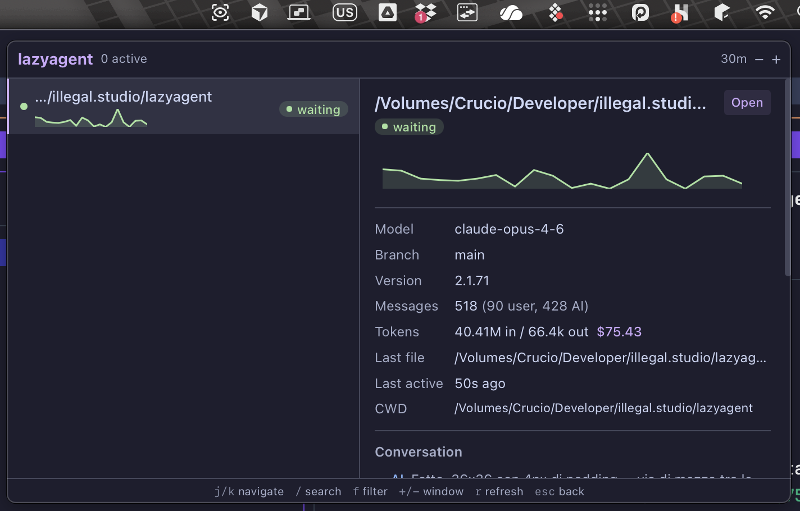
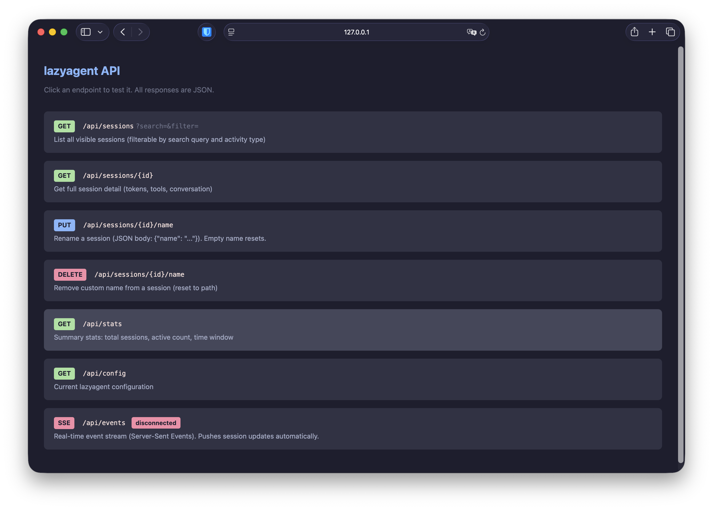

# lazyagent


[](https://www.producthunt.com/products/lazy-agent)

A terminal UI, macOS menu bar app, and HTTP API for monitoring all your coding agents — [Claude Code](https://claude.ai/code), [Cursor](https://cursor.com/), [Codex](https://developers.openai.com/codex/), [Amp](https://ampcode.com/), [pi](https://github.com/badlogic/pi-mono), and [OpenCode](https://opencode.ai/) — from a single place. No lock-in, no server, purely observational.

Inspired by [lazygit](https://github.com/jesseduffield/lazygit), [lazyworktree](https://github.com/chmouel/lazyworktree), and [pixel-agents](https://github.com/pablodelucca/pixel-agents).

## Why lazyagent?

Unlike other tools, lazyagent doesn't replace your workflow — it watches it. Launch agents wherever you want (terminal, IDE, desktop app), lazyagent just observes. No lock-in, no server, no account required.

> ⭐ If lazyagent is useful to you, consider [starring the repo](https://github.com/illegalstudio/lazyagent) — it helps others discover it!

> **Want to support lazyagent's development?** If this project saves you time or you just love it, consider [becoming a sponsor](https://github.com/sponsors/nahime0). It keeps the project alive and growing — every bit counts!

### Terminal UI


### macOS Menu Bar App


### HTTP API


## How it works

lazyagent watches session data from coding agents to determine what each session is doing. No modifications to any agent are needed — it's purely observational.

**Supported agents:**
- **Claude Code CLI** — reads JSONL from `~/.claude/projects/*/`
- **Claude Code Desktop** — same JSONL files, enriched with session metadata (title, permissions) from `~/Library/Application Support/Claude/claude-code-sessions/`
- **Cursor** — reads SQLite from `~/Library/Application Support/Cursor/User/globalStorage/state.vscdb`
- **Codex CLI** — reads JSONL from `~/.codex/sessions/YYYY/MM/DD/*.jsonl`
- **Amp CLI** — reads thread JSON from `~/.local/share/amp/threads/*.json` (newer versions that no longer write local files are supported via periodic `amp threads export` sync)
- **pi coding agent** — reads JSONL from `~/.pi/agent/sessions/*/`
- **OpenCode** — reads SQLite from `~/.local/share/opencode/opencode.db`

Use `--agent claude`, `--agent pi`, `--agent opencode`, `--agent cursor`, `--agent codex`, `--agent amp`, or `--agent all` (default) to control which agents are monitored. Agents can also be enabled/disabled in the config file. Pi sessions are marked with a **π** prefix, Cursor with **C**, Codex with **X**, Amp with **A**, OpenCode with **O**, and Desktop sessions with a **D** prefix in the session list.

From the JSONL stream it detects activity states with color-coded labels:

- **idle** — Session file exists but no recent activity
- **waiting** — Claude responded, waiting for your input (with 10s grace period to avoid false positives)
- **thinking** — Claude is generating a response
- **compacting** — Context compaction in progress
- **reading** / **writing** / **running** / **searching** / **browsing** / **spawning** — Tool-specific activities

It also surfaces:

| Info | Source |
|------|--------|
| Working directory | JSONL |
| Git branch | JSONL |
| Claude version | JSONL |
| Model used | JSONL |
| Is git worktree | git rev-parse |
| Main repo path (if worktree) | git worktree |
| Message count (user/assistant) | JSONL |
| Token usage & estimated cost | JSONL |
| Activity sparkline (last N minutes) | JSONL |
| Last file written | JSONL |
| Recent conversation (last 5 messages) | JSONL |
| Last 20 tools used | JSONL |
| Last activity timestamp | JSONL |
| Session source (CLI / Desktop) | Desktop metadata |
| Desktop session title | Desktop metadata |
| Permission mode (Desktop) | Desktop metadata |
| Resume command | Computed per agent |
| Custom session name | `~/.config/lazyagent/session-names.json` |

## Three interfaces, one binary

lazyagent ships as a single binary with three interfaces:

| | TUI | macOS Detachable Menu Bar | HTTP API |
|---|---|---|---|
| Interface | Terminal (bubbletea) | Native menu bar panel (Wails v3 + Svelte 5) | REST + SSE |
| Launch | `lazyagent` | `lazyagent --gui` | `lazyagent --api` |
| Dock icon | N/A | Hidden (accessory) | N/A |
| Sparkline | Unicode braille characters | SVG area chart | JSON data |
| Theme | Terminal colors | Catppuccin Mocha (Tailwind 4) | N/A |

All three share `internal/core/` — session discovery, file watcher, activity state machine, cost estimation, and config. You can combine them freely: `lazyagent --tui --gui --api`.

## Install

### Homebrew

```bash
brew tap illegalstudio/tap
brew install lazyagent
```

### Go (TUI only)

```bash
go install github.com/illegalstudio/lazyagent@latest
```

### Build from source

```bash
git clone https://github.com/illegalstudio/lazyagent
cd lazyagent

# TUI only (no Wails/Node.js needed)
make tui

# Full build with menu bar app (requires Node.js for frontend)
make install   # npm install (first time only)
make build
```

## Usage

```
lazyagent                        Launch the terminal UI (monitors all agents)
lazyagent --agent claude         Monitor only Claude Code sessions
lazyagent --agent pi             Monitor only pi coding agent sessions
lazyagent --agent opencode       Monitor only OpenCode sessions
lazyagent --agent cursor         Monitor only Cursor sessions
lazyagent --agent codex          Monitor only Codex CLI sessions
lazyagent --agent amp            Monitor only Amp CLI sessions
lazyagent --agent all            Monitor all agents (default)
lazyagent --api                  Start the HTTP API (http://127.0.0.1:7421)
lazyagent --api --host :8080     Start the HTTP API on a custom address
lazyagent --tui --api            Launch TUI + API server
lazyagent --gui                  Launch as macOS menu bar app (detaches)
lazyagent --gui --api            Launch GUI + API server (foreground)
lazyagent --tui --gui --api      Launch everything
lazyagent --help                 Show help
```

### TUI

#### Keybindings

| Key | Action |
|-----|--------|
| `↑` / `k` | Move up / scroll up (detail) |
| `↓` / `j` | Move down / scroll down (detail) |
| `tab` | Switch focus between panels |
| `+` / `-` | Adjust time window (±10 minutes) |
| `f` | Cycle activity filter |
| `/` | Search sessions by project path |
| `o` | Open session CWD in editor (see below) |
| `c` | Copy resume command to clipboard |
| `r` | Rename session (empty name resets) |
| `q` / `ctrl+c` | Quit |

### macOS Detachable Menu Bar App

```
lazyagent --gui
```

The GUI process detaches automatically — your terminal returns immediately. The app lives in your menu bar with no Dock icon. Click the tray icon to toggle the panel.

The panel is **detachable**: press `d` or click the detach button to pop it out into a standalone resizable window. Once detached, you can pin it always-on-top. Press `d` again or close the window to snap it back to the menu bar.

#### Keybindings

| Key | Action |
|-----|--------|
| `↑` / `k` | Move up |
| `↓` / `j` | Move down |
| `+` / `-` | Adjust time window (±10 minutes) |
| `f` | Cycle activity filter |
| `/` | Search sessions |
| `r` | Rename session (empty name resets) |
| `d` | Detach/attach window |
| `esc` | Close detail / dismiss search |

#### Right-click menu

- **Show Panel** — open the session panel
- **Refresh Now** — force reload all sessions
- **Quit** — exit the app

### HTTP API

```
lazyagent --api
```

Starts a read-only HTTP API server on `http://127.0.0.1:7421` (default port, with automatic fallback if busy).

| Endpoint | Description |
|----------|-------------|
| `GET /api` | Interactive playground (open in browser) |
| `GET /api/sessions` | List visible sessions (`?search=`, `?filter=`) |
| `GET /api/sessions/{id}` | Full session detail |
| `PUT /api/sessions/{id}/name` | Rename session (`{"name": "..."}`, empty resets) |
| `DELETE /api/sessions/{id}/name` | Remove custom name |
| `GET /api/stats` | Summary stats (total, active, window) |
| `GET /api/config` | Current configuration |
| `GET /api/events` | SSE stream for real-time updates |

To expose on the network (e.g. for a mobile app):

```bash
lazyagent --api --host 0.0.0.0:7421
```

Full API documentation: [docs/API.md](docs/API.md)

### Editor support

Pressing `o` (TUI) or the **Open** button (app) opens the selected session's working directory in your editor.

**Cursor sessions** automatically open in Cursor IDE (if the `cursor` CLI is installed). If not installed, the standard editor flow below is used.

| Configuration | Behavior |
|---------------|----------|
| Both `$VISUAL` and `$EDITOR` set | A picker popup asks which one to use (TUI only) |
| Only `$VISUAL` set | Opens directly as GUI editor |
| Only `$EDITOR` set | Opens directly as TUI editor (suspends the TUI) |
| Neither set | Shows a hint to configure them |

```bash
# Example: add to ~/.zshrc or ~/.bashrc
export VISUAL="code"   # GUI editor (VS Code, Cursor, Zed, …)
export EDITOR="nvim"   # TUI editor (vim, nvim, nano, …)
```

## Configuration

lazyagent reads `~/.config/lazyagent/config.json` (created automatically with defaults on first run):

```json
{
  "window_minutes": 30,
  "default_filter": "",
  "editor": "",
  "launch_at_login": false,
  "notifications": false,
  "notify_after_sec": 30,
  "agents": {
    "amp": true,
    "claude": true,
    "codex": true,
    "cursor": true,
    "opencode": true,
    "pi": true
  },
  "claude_dirs": []
}
```

| Field | Default | Description |
|-------|---------|-------------|
| `window_minutes` | `30` | Time window for session visibility (minutes) |
| `default_filter` | `""` | Default activity filter (empty = show all) |
| `editor` | `""` | Override for `$VISUAL`/`$EDITOR` |
| `launch_at_login` | `false` | Auto-start the menu bar app at login |
| `notifications` | `false` | macOS notifications when a session needs input |
| `notify_after_sec` | `30` | Seconds before triggering a "waiting" notification |
| `agents` | all `true` | Enable/disable individual agent providers |
| `claude_dirs` | `[]` | Extra Claude base directories to scan (each must contain a `projects/` subfolder). When empty, auto-detects from `CLAUDE_CONFIG_DIR` env var with `~/.claude` fallback |

## Architecture

```
lazyagent/
├── main.go                     # Entry point: dispatches --tui / --tray / --api / --agent
├── internal/
│   ├── core/                   # Shared: watcher, activity, session, config, helpers
│   │   └── provider.go         # SessionProvider interface + Multi/Live/Pi/OpenCode/Cursor/Codex/Amp providers
│   ├── model/                  # Shared types (Session, ToolCall, etc.)
│   ├── amp/                    # Amp CLI thread parsing and session discovery
│   ├── claude/                 # Claude Code JSONL parsing, desktop metadata, session discovery
│   ├── codex/                  # Codex CLI JSONL parsing and session discovery
│   ├── cursor/                 # Cursor IDE session discovery from state.vscdb
│   ├── pi/                     # pi coding agent JSONL parsing, session discovery
│   ├── opencode/               # OpenCode SQLite parsing, session discovery
│   ├── api/                    # HTTP API server (REST + SSE)
│   ├── ui/                     # TUI rendering (bubbletea + lipgloss)
│   ├── tray/                   # macOS menu bar app (Wails v3, build-tagged)
│   └── assets/                 # Embedded frontend dist (go:embed)
├── frontend/                   # Svelte 5 + Tailwind 4 (menu bar app UI)
│   ├── src/
│   │   ├── App.svelte
│   │   ├── lib/                # SessionList, SessionDetail, Sparkline, ActivityBadge
│   │   └── bindings/           # Auto-generated Wails TypeScript bindings
│   └── app.css                 # Tailwind 4 @theme (Catppuccin Mocha)
├── docs/                       # Documentation
│   └── API.md                  # Full HTTP API reference
└── Makefile
```

## Development

```bash
# Install frontend deps (first time)
make install

# Full build (TUI + tray)
make build

# Build TUI only (no Wails/Node.js needed)
make tui

# Quick dev cycle (rebuild + run tray)
make dev

# Clean all artifacts
make clean
```

### Requirements

- Go 1.25+
- Node.js 18+ (for frontend build)
- macOS (for the menu bar app — TUI works on any platform)

## Roadmap

### v0.1 — Core TUI
- [x] Discover all Claude Code sessions from `~/.claude/projects/`
- [x] Parse JSONL to determine session status
- [x] Detect worktrees
- [x] Show tool history
- [x] FSEvents-based file watcher with debouncing
- [x] Fallback 30s polling

### v0.2 — Richer session info
- [x] Conversation preview in detail panel (last 5 messages, User/AI labels)
- [x] Last file written with age
- [x] Filter sessions by activity type
- [x] Search sessions by project path
- [x] Time window control (show last N minutes)
- [x] Color-coded activity states with grace periods
- [x] Memory-efficient single-pass JSONL parsing
- [x] Activity sparkline graph in session list
- [x] Token usage and cost estimation in detail panel
- [x] Animated braille spinner for active sessions
- [x] `o` key to open session CWD in editor
- [x] Rename sessions with persistent custom names (`r` key)
- [ ] Display file diff for last written file

### v0.3 — macOS menu bar app
- [x] Core library extraction (`internal/core/`)
- [x] Shared config system (`~/.config/lazyagent/config.json`)
- [x] Wails v3 + Svelte 5 + Tailwind 4 frontend
- [x] System tray with attached panel (frameless, translucent, floating)
- [x] Real-time session updates via FSEvents + event push
- [x] SVG sparkline, activity badges, conversation preview
- [x] Keyboard shortcuts (j/k, /, f, +/-, r, esc)
- [x] Open in editor from detail panel
- [ ] Dynamic tray icon (active session count)
- [ ] macOS notifications when session needs input
- [ ] Launch at Login
- [ ] Code signing & notarization
- [ ] DMG distribution
- [ ] Homebrew cask

### v0.4 — HTTP API
- [x] REST API server (`--api` flag)
- [x] Session list, detail, stats, config endpoints
- [x] Server-Sent Events (SSE) for real-time push updates
- [x] Interactive API playground (`/api` in browser)
- [x] Default port with automatic fallback (7421–7431)
- [x] Custom bind address (`--host`)
- [x] Combinable with TUI and tray (`--tui --tray --api`)
- [x] Session rename endpoints (`PUT`/`DELETE /api/sessions/{id}/name`)

### v0.5 — Multi-agent support
- [x] pi coding agent session discovery (`~/.pi/agent/sessions/`)
- [x] Pi JSONL parser (tree-structured format → shared Session struct)
- [x] `--agent` flag (`claude`, `pi`, `all`)
- [x] MultiProvider merging sessions from multiple agents
- [x] Agent type indicator (π prefix in list, Agent row in detail)
- [x] Pi tool name normalization (snake_case → PascalCase)
- [x] Multi-directory file watcher
- [x] Cost estimation for Gemini and GPT model families
- [x] Claude Code Desktop support (title, permissions, source badge)
- [x] Shared session types extracted to `internal/model`

### v0.6 — OpenCode support
- [x] OpenCode session discovery from SQLite (`~/.local/share/opencode/opencode.db`)
- [x] `--agent opencode` flag
- [x] Polling-based refresh (5s interval, no file watcher needed)
- [x] Tool name normalization and activity mapping
- [x] Subagent detection via `parent_id`

### v0.7 — Cursor support
- [x] Cursor session discovery from `state.vscdb` (composerData + bubbleId entries)
- [x] `--agent cursor` flag
- [x] WAL-based cache invalidation for real-time updates
- [x] CWD inference from file URIs when workspace URI is unavailable
- [x] Cursor tool name normalization (Read_file_v2, Glob_file_search, etc.)
- [x] Open in Cursor IDE (with fallback if CLI not installed)
- [x] Per-agent enable/disable in config (`agents` map)

### Future ideas
- [ ] Outbound webhooks on status changes
- [ ] Multi-machine support via shared config / remote API
- [ ] TUI actions: kill session, attach terminal
- [ ] Session history browser (browse past conversations)
