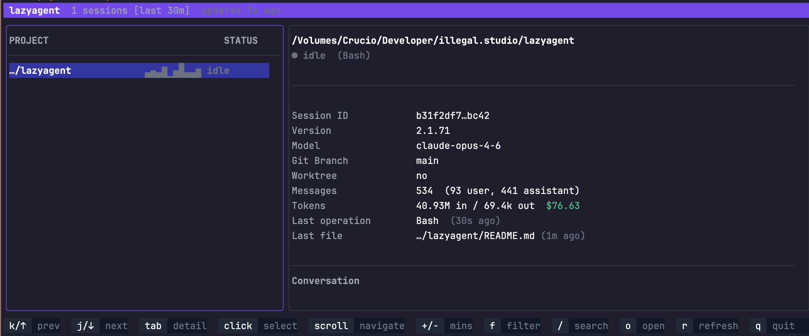

# lazyagent


A terminal UI and macOS menu bar app for monitoring all running [Claude Code](https://claude.ai/code) instances on your machine — inspired by [lazygit](https://github.com/jesseduffield/lazygit), [lazyworktree](https://github.com/chmouel/lazyworktree) and [pixel-agents](https://github.com/pablodelucca/pixel-agents).




## How it works

lazyagent watches Claude Code's JSONL transcript files (`~/.claude/projects/*/`) to determine what each session is doing. No modifications to Claude Code are needed — it's purely observational.

From the JSONL stream it detects activity states with color-coded labels:

- **idle** — Session file exists but no recent activity
- **waiting** — Claude responded, waiting for your input (with 10s grace period to avoid false positives)
- **thinking** — Claude is generating a response
- **compacting** — Context compaction in progress
- **reading** / **writing** / **running** / **searching** / **browsing** / **spawning** — Tool-specific activities

It also surfaces:

| Info | Source |
|------|--------|
| Working directory | JSONL |
| Git branch | JSONL |
| Claude version | JSONL |
| Model used | JSONL |
| Is git worktree | git rev-parse |
| Main repo path (if worktree) | git worktree |
| Message count (user/assistant) | JSONL |
| Token usage & estimated cost | JSONL |
| Activity sparkline (last N minutes) | JSONL |
| Last file written | JSONL |
| Recent conversation (last 5 messages) | JSONL |
| Last 20 tools used | JSONL |
| Last activity timestamp | JSONL |

## Two interfaces, one binary

lazyagent ships as a single binary with two interfaces:

| | TUI | macOS Menu Bar |
|---|---|---|
| Interface | Terminal (bubbletea) | Native menu bar panel (Wails v3 + Svelte 5) |
| Launch | `lazyagent` | `lazyagent --tray` |
| Dock icon | N/A | Hidden (accessory) |
| Sparkline | Unicode braille characters | SVG area chart |
| Theme | Terminal colors | Catppuccin Mocha (Tailwind 4) |

Both share `internal/core/` — session discovery, file watcher, activity state machine, cost estimation, and config. You can run both simultaneously with `lazyagent --tui --tray`.

## Install

### Homebrew (TUI)

```bash
brew tap illegalstudio/tap
brew install lazyagent
```

### Go (TUI only)

```bash
go install github.com/nahime0/lazyagent@latest
```

### Build from source

```bash
git clone https://github.com/nahime0/lazyagent
cd lazyagent

# TUI only (no Wails/Node.js needed)
make tui

# Full build with menu bar app (requires Node.js for frontend)
make install   # npm install (first time only)
make build
```

### macOS note

On first launch, macOS may block the binary. Go to **System Settings → Privacy & Security**, scroll down and click **Allow Anyway**, then run it again.

## Usage

```
lazyagent                Launch the terminal UI
lazyagent --tui          Launch the terminal UI (explicit)
lazyagent --tray         Launch as macOS menu bar app (detaches automatically)
lazyagent --tui --tray   Launch both TUI and tray app
lazyagent --help         Show help
```

### TUI

#### Keybindings

| Key | Action |
|-----|--------|
| `↑` / `k` | Move up / scroll up (detail) |
| `↓` / `j` | Move down / scroll down (detail) |
| `tab` | Switch focus between panels |
| `+` / `-` | Adjust time window (±10 minutes) |
| `f` | Cycle activity filter |
| `/` | Search sessions by project path |
| `o` | Open session CWD in editor (see below) |
| `r` | Force refresh |
| `q` / `ctrl+c` | Quit |

### macOS Menu Bar App

```
lazyagent --tray
```

The tray process detaches automatically — your terminal returns immediately. The app lives in your menu bar with no Dock icon. Click the tray icon to toggle the panel.

#### Keybindings

| Key | Action |
|-----|--------|
| `↑` / `k` | Move up |
| `↓` / `j` | Move down |
| `+` / `-` | Adjust time window (±10 minutes) |
| `f` | Cycle activity filter |
| `/` | Search sessions |
| `r` | Force refresh |
| `esc` | Close detail / dismiss search |

#### Right-click menu

- **Show Panel** — open the session panel
- **Refresh Now** — force reload all sessions
- **Quit** — exit the app

### Editor support

Pressing `o` (TUI) or the **Open** button (app) opens the selected session's working directory in your editor.

| Configuration | Behavior |
|---------------|----------|
| Both `$VISUAL` and `$EDITOR` set | A picker popup asks which one to use (TUI only) |
| Only `$VISUAL` set | Opens directly as GUI editor |
| Only `$EDITOR` set | Opens directly as TUI editor (suspends the TUI) |
| Neither set | Shows a hint to configure them |

```bash
# Example: add to ~/.zshrc or ~/.bashrc
export VISUAL="code"   # GUI editor (VS Code, Cursor, Zed, …)
export EDITOR="nvim"   # TUI editor (vim, nvim, nano, …)
```

## Configuration

lazyagent reads `~/.config/lazyagent/config.json` (created automatically with defaults on first run):

```json
{
  "windowMinutes": 30,
  "defaultFilter": "",
  "editor": "",
  "launchAtLogin": false,
  "notifications": false,
  "notifyAfterSec": 30
}
```

| Field | Default | Description |
|-------|---------|-------------|
| `windowMinutes` | `30` | Time window for session visibility (minutes) |
| `defaultFilter` | `""` | Default activity filter (empty = show all) |
| `editor` | `""` | Override for `$VISUAL`/`$EDITOR` |
| `launchAtLogin` | `false` | Auto-start the menu bar app at login |
| `notifications` | `false` | macOS notifications when a session needs input |
| `notifyAfterSec` | `30` | Seconds before triggering a "waiting" notification |

## Architecture

```
lazyagent/
├── main.go                     # Entry point: dispatches --tui / --tray / both
├── internal/
│   ├── core/                   # Shared: watcher, activity, session, config, helpers
│   ├── claude/                 # JSONL parsing, types, session discovery
│   ├── ui/                     # TUI rendering (bubbletea + lipgloss)
│   ├── tray/                   # macOS menu bar app (Wails v3, build-tagged)
│   └── assets/                 # Embedded frontend dist (go:embed)
├── frontend/                   # Svelte 5 + Tailwind 4 (menu bar app UI)
│   ├── src/
│   │   ├── App.svelte
│   │   ├── lib/                # SessionList, SessionDetail, Sparkline, ActivityBadge
│   │   └── bindings/           # Auto-generated Wails TypeScript bindings
│   └── app.css                 # Tailwind 4 @theme (Catppuccin Mocha)
└── Makefile
```

## Development

```bash
# Install frontend deps (first time)
make install

# Full build (TUI + tray)
make build

# Build TUI only (no Wails/Node.js needed)
make tui

# Quick dev cycle (rebuild + run tray)
make dev

# Clean all artifacts
make clean
```

### Requirements

- Go 1.25+
- Node.js 18+ (for frontend build)
- macOS (for the menu bar app — TUI works on any platform)

## Roadmap

### v0.1 — Core TUI
- [x] Discover all Claude Code sessions from `~/.claude/projects/`
- [x] Parse JSONL to determine session status
- [x] Detect worktrees
- [x] Show tool history
- [x] FSEvents-based file watcher with debouncing
- [x] Fallback 30s polling

### v0.2 — Richer session info
- [x] Conversation preview in detail panel (last 5 messages, User/AI labels)
- [x] Last file written with age
- [x] Filter sessions by activity type
- [x] Search sessions by project path
- [x] Time window control (show last N minutes)
- [x] Color-coded activity states with grace periods
- [x] Memory-efficient single-pass JSONL parsing
- [x] Activity sparkline graph in session list
- [x] Token usage and cost estimation in detail panel
- [x] Animated braille spinner for active sessions
- [x] `o` key to open session CWD in editor
- [ ] Display file diff for last written file

### v0.3 — macOS menu bar app
- [x] Core library extraction (`internal/core/`)
- [x] Shared config system (`~/.config/lazyagent/config.json`)
- [x] Wails v3 + Svelte 5 + Tailwind 4 frontend
- [x] System tray with attached panel (frameless, translucent, floating)
- [x] Real-time session updates via FSEvents + event push
- [x] SVG sparkline, activity badges, conversation preview
- [x] Keyboard shortcuts (j/k, /, f, +/-, r, esc)
- [x] Open in editor from detail panel
- [ ] Dynamic tray icon (active session count)
- [ ] macOS notifications when session needs input
- [ ] Launch at Login
- [ ] Code signing & notarization
- [ ] DMG distribution
- [ ] Homebrew cask

### Future ideas
- [ ] HTTP API with SSE streaming
- [ ] Outbound webhooks on status changes
- [ ] Multi-machine support via shared config / remote API
- [ ] TUI actions: kill session, attach terminal
- [ ] Session history browser (browse past conversations)
