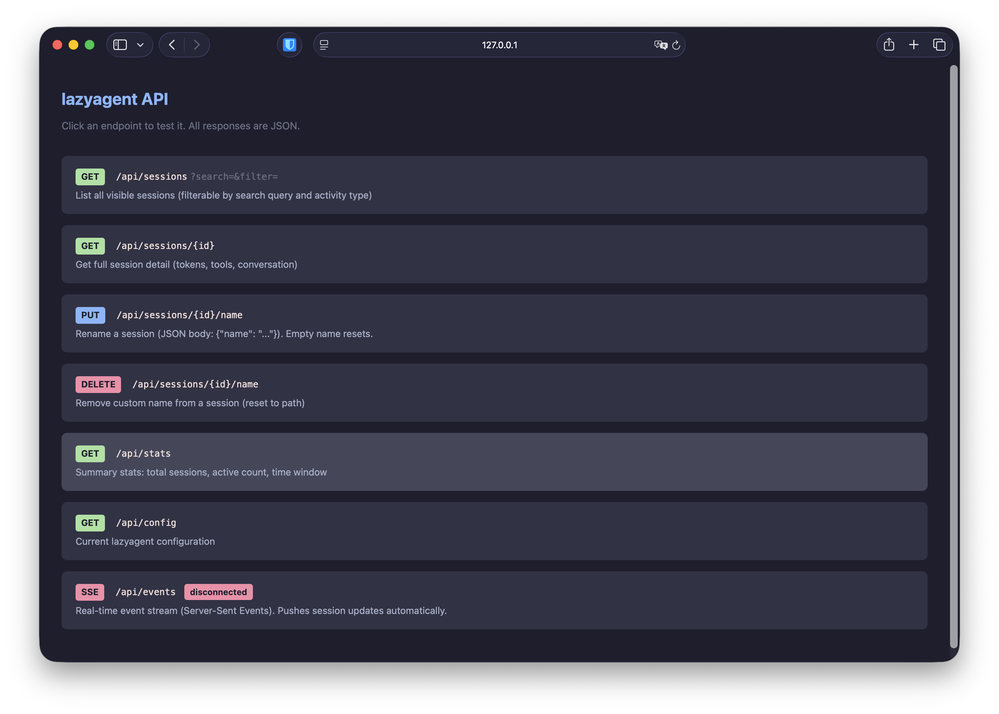

<p align="center">
  
</p>

<h1 align="center">lazyagent</h1>

<p align="center">
  <em>One lazy eye on all your coding agents.</em>
</p>

<p align="center">
  <a href="https://github.com/illegalstudio/lazyagent/stargazers"></a>
  <a href="https://github.com/illegalstudio/lazyagent/releases"></a>
  <a href="LICENSE"></a>
  <a href="https://www.producthunt.com/products/lazy-agent"></a>
  <a href="https://apps.apple.com/us/app/lazyagent/id6773359156"></a>
  <a href="https://x.com/nahime0"></a>
</p>

<p align="center">
  <strong>9 agents supported &middot; TUI + desktop app + HTTP API &middot; No server, no lock-in &middot; MIT</strong>
</p>

<p align="center">
  A terminal UI, a macOS/Linux desktop app, and an HTTP API for monitoring all your coding agents from a single place.
  Watch sessions from <a href="https://claude.ai/code">Claude Code</a>, <a href="https://cursor.com/">Cursor</a>, <a href="https://developers.openai.com/codex/">Codex</a>, <a href="https://x.ai/cli">Grok CLI</a>, <a href="https://kilo.ai/">Kilo</a>, Kimi Code CLI, <a href="https://ampcode.com/">Amp</a>, <a href="https://github.com/badlogic/pi-mono">pi</a>, and <a href="https://opencode.ai/">OpenCode</a> — lazyagent doesn't replace your workflow, it watches it.
</p>

<p align="center">
  <a href="https://lazyagent.dev"><strong>Official Website</strong></a>
</p>

---

> **lazyagent is a full desktop application.** macOS ships as `Lazyagent.app`; Linux ships as native DEB/RPM/Arch packages plus an AppImage. Every desktop package includes the familiar `lazyagent` command alongside the GUI. Only interested in the CLI? Install the standalone build with `brew install illegalstudio/tap/lazyagent-cli` — same command, TUI and HTTP API included, no GUI.

Inspired by [lazygit](https://github.com/jesseduffield/lazygit), [lazyworktree](https://github.com/chmouel/lazyworktree), and [pixel-agents](https://github.com/pablodelucca/pixel-agents).

## Support the project

⭐ If lazyagent is useful to you, consider [starring the repo](https://github.com/illegalstudio/lazyagent) — it helps others discover it!

💛 Loving it? Consider [becoming a sponsor](https://github.com/sponsors/nahime0) to keep the project alive and growing.

## lazyagent for iOS

Want to keep an eye on your agents from your pocket? **[lazyagent is available on the App Store](https://apps.apple.com/us/app/lazyagent/id6773359156)** for iPhone and iPad.

The iOS app is a **paid** app — and that's on purpose. Buying it is one of the easiest ways to support the project and keep development going. Thank you! 💛

That said, lazyagent and its API are **fully open source**. If you'd rather not pay for the app, you're more than welcome to build your own client on top of the API — that's exactly what it's there for. No hard feelings, the choice is yours. 🙂

## News

📢 **Session tools are here!** Commands to find, reopen, search, and maintain your agent sessions — plus keep rate-limit usage visible:

- **[`lazyagent prune`](docs/maintenance/prune.md)** — delete chat files older than N days or whose project folder no longer exists. Interactive agent picker, dry-run previews, and per-project row selection at the confirmation prompt.
- **[`lazyagent compact`](docs/maintenance/compact.md)** — shrink session files in place by truncating bulky tool outputs, thinking blocks, and embedded images — sessions stay resumable with the originating agent. Supports Claude Code, pi, Codex, Grok, and Kimi.
- **[`lazyagent search`](docs/maintenance/search.md)** — search transcript-file agents (Claude, Codex, pi, Amp, Grok, Kimi) with highlighted snippets and an incremental local index.
- **[`lazyagent limits`](docs/maintenance/limits.md)** — on-demand rate-limit / billing summary for Claude Code (5h + 7d), Codex (5h + 7d), Grok (monthly), Kimi Code, and Cursor (monthly, Models + API pools), with a detailed pace view available via `--detailed`.
- **[`lazyagent sessions`](docs/usage/sessions.md)**: list every session recorded for the current directory, across all agents, and reopen one normally or in YOLO mode. Interactive picker, `--json` for scripts. The old `history` name remains available as an alias.
- **[`lazyagent latest`](docs/usage/latest.md)**: resume the current directory's most recent session immediately, normally or with `--yolo`. No table, no prompt.
- **Outbound webhooks on session state transitions** — send a signed JSON payload to Slack, a custom dashboard, or a CI endpoint whenever a session goes idle, waits for input, or changes state. See [Webhooks](docs/reference/webhooks.md).

Typical savings on a year of daily use: **80+ MiB reclaimed** across the cleanup commands, with every rewrite validated and backed up by default.

## Why lazyagent?

Unlike other tools, lazyagent doesn't replace your workflow — it watches it. Launch agents wherever you want (terminal, IDE, desktop app), lazyagent just observes. No lock-in, no server, no account required.

### Terminal UI


### Desktop App


Detach the panel and lazyagent becomes a full desktop app with a Dock icon, Cmd-Tab, native menus, a card-grid dashboard (`compact | rich | live` density switch), per-card normal and YOLO Resume actions, an Editor action with a right-click menu, and a Settings panel (terminal choice, editor, agents, API passphrase). Attach again to return it to the menu bar.

### HTTP API


## Install

> **Packaging change:** the macOS cask now installs `Lazyagent.app` instead of a bare binary; the `lazyagent` command still works — the cask links it into Homebrew's bin at install time, and the `lazyagent-cli` formula provides the same command for CLI-only setups. The cask and the formula conflict on purpose: the app already includes the CLI.

### Homebrew

**Desktop app** (macOS, universal binary — TUI + GUI + HTTP API):

```bash
brew install --cask illegalstudio/tap/lazyagent
```

Installs `Lazyagent.app` and links the `lazyagent` command into Homebrew's bin — the CLI works immediately, no first launch required.

**CLI only** (macOS, Linux — TUI + HTTP API, no GUI):

```bash
brew install illegalstudio/tap/lazyagent-cli
```

### Linux desktop

Download the desktop package for your distribution from [GitHub Releases](https://github.com/illegalstudio/lazyagent/releases):

```bash
# Debian / Ubuntu
sudo apt install ./Lazyagent_VERSION_linux_amd64.deb

# Fedora
sudo dnf install ./Lazyagent_VERSION_linux_amd64.rpm

# Arch Linux
sudo pacman -U ./Lazyagent_VERSION_linux_amd64.pkg.tar.zst

# Portable fallback
chmod +x Lazyagent_VERSION_linux_amd64.AppImage
./Lazyagent_VERSION_linux_amd64.AppImage
```

The native packages install the desktop launcher and the `lazyagent` command. See the [Linux GUI guide](docs/interfaces/linux-gui.md) for dependencies and tray compatibility.

### Go (TUI only)

```bash
go install github.com/illegalstudio/lazyagent@latest
```

### Build from source

```bash
git clone https://github.com/illegalstudio/lazyagent
cd lazyagent

# TUI only (no Wails/Node.js needed)
make tui

# Full build with desktop support (requires Node.js and platform libraries)
make install   # npm install (first time only)
make build

# Linux desktop packages
make linux-packages VERSION=0.13.6
```

## Launch

```
lazyagent                    Launch the terminal UI (monitors all agents)
lazyagent --agent claude     Monitor only Claude Code sessions
lazyagent --agent grok       Monitor only Grok CLI sessions
lazyagent --agent kimi       Monitor only Kimi Code CLI sessions
lazyagent --api              Start the HTTP API (Bearer-token protected)
lazyagent --gui              Launch the desktop app (menu bar)
lazyagent --tui --gui --api  Run everything together
lazyagent prune --days N     Delete chat sessions older than N days
lazyagent compact            Shrink chat files by truncating bulky payloads
lazyagent search "query"     Search chat transcripts with snippets
lazyagent search --yolo "q"  Open a selected search result in YOLO mode
lazyagent sessions           List and reopen sessions for the current directory
lazyagent sessions --yolo    Reopen a selected session in YOLO mode
lazyagent history            Alias for lazyagent sessions
lazyagent latest             Resume the most recent session here
lazyagent latest --yolo      Resume the most recent session in YOLO mode
lazyagent limits             Show 5h / weekly / monthly usage summary
lazyagent passphrase         Set or rotate the HTTP API passphrase
lazyagent --help             Show full help
```

## Documentation

Full documentation — supported agents, activity states, keybindings, configuration, the HTTP API, maintenance commands, and architecture — lives at:

- **[lazyagent.dev/docs](https://lazyagent.dev/docs)** — rendered website
- [`docs/`](docs/) — Markdown sources in this repository, organized by topic:
  - [Getting started](docs/getting-started/) — install, quickstart
  - [Concepts](docs/concepts/) — how it works, supported agents, activity states, session info
  - [Interfaces](docs/interfaces/) — terminal UI, macOS/Linux GUI, HTTP API
  - [Usage](docs/usage/) — CLI reference, directory-scoped sessions, recipes
  - [Maintenance](docs/maintenance/) — `prune`, `compact`, `search`, and `limits` commands
  - [Reference](docs/reference/) — configuration, architecture, development, roadmap

## License

MIT
