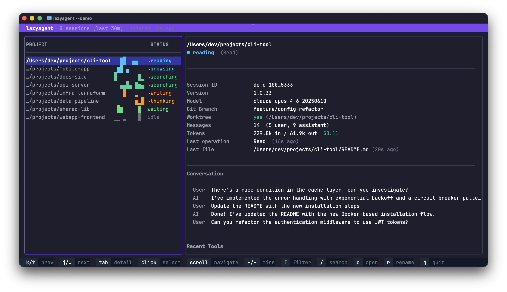

The TUI is what you get with no flags:

```bash
lazyagent
```

It's the default because it's the most information-dense interface. The layout is two panels: a session list on the left and a detail view on the right, plus a bottom help bar.



## Keybindings

| Key | Action |
|-----|--------|
| <kbd>↑</kbd> / <kbd>k</kbd> | Move up / scroll up (detail panel) |
| <kbd>↓</kbd> / <kbd>j</kbd> | Move down / scroll down (detail panel) |
| <kbd>tab</kbd> | Switch focus between panels |
| <kbd>+</kbd> / <kbd>-</kbd> | Adjust time window (±10 minutes) |
| <kbd>f</kbd> | Cycle activity filter (`all` → `active` → `waiting` → …) |
| <kbd>/</kbd> | Search sessions by project path |
| <kbd>o</kbd> | Open the selected session's CWD in your editor |
| <kbd>c</kbd> | Copy the resume command to the clipboard |
| <kbd>r</kbd> | Rename the session (empty name resets to default) |
| <kbd>esc</kbd> | Close detail overlay / dismiss search |
| <kbd>q</kbd> / <kbd>ctrl+c</kbd> | Quit |

## Visual indicators

- **Agent prefix** — a one-character prefix (π, D, C, X, A, O) identifies which agent produced the session. See [Supported agents](../concepts/supported-agents.md).
- **Activity badge** — a colored state label (`idle`, `thinking`, `writing`, …). See [Activity states](../concepts/activity-states.md).
- **Braille spinner** — animates while the session is actively executing.
- **Sparkline** — a Unicode braille mini-chart of the last N minutes of activity.

## Themes

Two themes ship in: `dark` (default) and `light`. Switch by setting `tui.theme` in [Configuration](../reference/configuration.md):

```json
{
  "tui": { "theme": "light" }
}
```

Every color — panels, activity states, help bar, overlays — is driven by the theme, so both variants are fully coherent.

## Combining with other interfaces

The TUI can run side by side with the HTTP API:

```bash
lazyagent --tui --api
```

On macOS you can also combine it with the menu bar app:

```bash
lazyagent --tui --gui --api
```

The GUI detaches into its own process so the terminal stays interactive. See [macOS GUI](macos-gui.md) and [HTTP API](http-api.md) for the companion interfaces.
