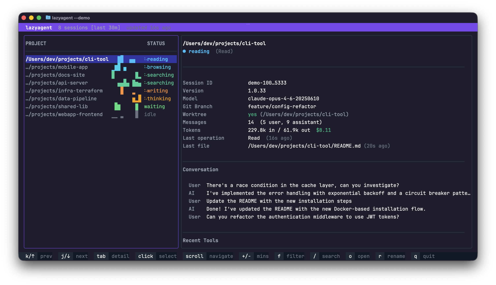

The TUI is what you get with no flags:

```bash
lazyagent
```

It's the default because it's the most information-dense interface. The layout is two panels: a session list on the left and a detail view on the right, plus a bottom help bar.



## Keybindings

| Key | Action |
|-----|--------|
| <kbd>↑</kbd> / <kbd>k</kbd> | Move up / scroll up (detail panel) |
| <kbd>↓</kbd> / <kbd>j</kbd> | Move down / scroll down (detail panel) |
| <kbd>tab</kbd> | Switch focus between panels |
| <kbd>+</kbd> / <kbd>-</kbd> | Adjust time window (±10 minutes) |
| <kbd>f</kbd> | Cycle activity filter (`all` → `active` → `waiting` → …) |
| <kbd>/</kbd> | Search sessions by project path |
| <kbd>o</kbd> | Open the selected session's CWD in your editor |
| <kbd>c</kbd> | Copy the resume command to the clipboard, when available |
| <kbd>C</kbd> | Copy the YOLO resume command, when the agent exposes one |
| <kbd>l</kbd> | Open or close the limits view |
| <kbd>r</kbd> | Rename the session; refresh while the limits view is open |
| <kbd>esc</kbd> | Close detail overlay / dismiss search |
| <kbd>q</kbd> / <kbd>ctrl+c</kbd> | Quit |

## Visual indicators

- **Agent prefix** — a one-character prefix (π, D, C, X, A, O, L, G, K) identifies which agent produced the session. See [Supported agents](../concepts/supported-agents.md).
- **Activity badge** — a colored state label (`idle`, `thinking`, `writing`, …). See [Activity states](../concepts/activity-states.md).
- **Braille spinner** — animates while the session is actively executing.
- **Sparkline** — a Unicode braille mini-chart of the last N minutes of activity.

## Startup and cache

The first session load is progressive: results appear as each agent provider
finishes, while the title bar shows `loading…`. Once every provider has
completed, the indicator disappears and normal watcher-driven refreshes take
over.

The TUI reuses lazyagent's persistent discovery cache across process runs.
This makes later startups faster but also means session metadata and short
transcript snippets may be stored in the system cache directory. See
[Persistent discovery cache](../concepts/how-it-works.md#persistent-discovery-cache)
for location, permissions, and cleanup behavior.

## Themes

Three values ship in: `auto` — the default for new installations — plus `dark` and `light`. Set `tui.theme` in [Configuration](../reference/configuration.md):

```json
{
  "tui": { "theme": "auto" }
}
```

Every color — panels, activity states, help bar, overlays — is driven by the theme, so both palettes are fully coherent.

### How `auto` works

At startup, before the TUI takes over the screen, lazyagent asks the terminal for its background color with an OSC 11 query and picks the matching palette. The answer is read once: changing your terminal's theme while lazyagent is running does not repaint it until you restart.

Detection does not always succeed, and every failure resolves to `dark` — what the TUI used unconditionally before `auto` existed, so nothing gets worse than the previous release:

| Situation | Result |
|-----------|--------|
| The terminal answers the query | Detected palette |
| The terminal ignores it (notably inside `tmux`), unless `COLORFGBG` is set | Dark |
| `COLORFGBG` is set but the terminal has no OSC support | Derived from `COLORFGBG` |
| Output is not a terminal (piped or redirected) | Dark |
| The `CI` environment variable is non-empty | Dark, regardless of whether a real terminal is attached |
| A pty relays bytes but nothing answers either query — e.g. `docker run -t` without an interactive client, `script`/`expect` wrappers, some CI runners that allocate a tty | Dark, but only after a delay of up to ~5 seconds |

`tmux` and `screen` are recognized by their `TERM` prefix and fail instantly, before any query is sent — that's the fast path above. The slow path is the last row: lazyagent writes the query and blocks waiting for a reply that never comes, so nothing appears on screen for up to five seconds. Set `"dark"` or `"light"` explicitly to skip detection entirely and avoid both the ambiguity and the possible delay — an explicit value never queries the terminal, so startup stays instant.

**Existing installations keep what they have.** lazyagent writes the config file on first run, so an install predating `auto` already carries `"theme": "dark"`. A config with no `tui` block at all (for example, a hand-trimmed file) expresses no theme choice and picks up `"theme": "auto"` instead. Set `"theme": "auto"` by hand to opt in.

## Combining with other interfaces

The TUI can run side by side with the HTTP API:

```bash
lazyagent --tui --api
```

On macOS you can also combine it with the desktop app:

```bash
lazyagent --tui --gui --api
```

The GUI detaches into its own process so the terminal stays interactive. See [macOS GUI](macos-gui.md), [Linux GUI](linux-gui.md), and [HTTP API](http-api.md) for the companion interfaces.
